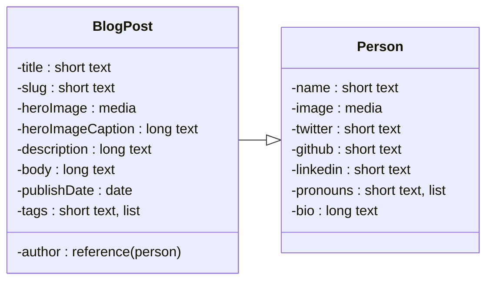

# Defensive Stance Blog

I used this great [Contentful Gatsby Starter](https://github.com/contentful-userland/gatsby-contentful-starter) as a base for this site. While the starter was extremely helpful in hitting the ground running, I had to make some modifications for personalization, bug fixes, patching, and deploying with S3/Cloudfront instead of their recommended services [Travis CI](https://travis-ci.org/) or [Netlify](https://www.netlify.com/)

## Starter Features

- Simple content model and structure. Easy to adjust to your needs.
- Use the Contentful [synchronization feature](https://www.contentful.com/developers/docs/references/content-delivery-api/#/reference/synchronization) of their [Delivery API](https://www.contentful.com/developers/docs/references/content-delivery-api/).
- Responsive/adaptive images via [gatsby-plugin-image](https://www.gatsbyjs.org/packages/gatsby-plugin-image/) and Contentful [Images API](https://www.contentful.com/developers/docs/references/content-delivery-api/#/reference/synchronization/initial-synchronization-of-entries-of-a-specific-content-type).

## My New Features

- Updated deployment scripts/configs to AWS S3/Cloudfront
- Added a required 404 page to be compatible with Cloudfront deployment
- Added a bio component to allow the author to brag about themselves on the front page

## Contentful Content Model


## Getting started
Install the pre-requisites on your development environment.
1. Install Node latest LTS version from https://nodejs.org/en/download/
2. Install the Gatsby CLI tool by running `npm install -g gatsby-cli`.
3. Install Git latest version from https://git-scm.com/downloads

### Get the source code and install dependencies.

```
$ git clone https://github.com/ash-napier/defensive-stance.git
$ npm install
```

Or use the [Gatsby CLI](https://www.npmjs.com/package/gatsby-cli).

```
$ gatsby new your-blog-name https://github.com/ash-napier/defensive-stance
```

## Set up your configurations
Rename ".sample.env.development" and ".sample.env.production" to ".env.development" and ".env.production" respectively. Add your environment variables here.

_Where to get the variables?_
1. Log in to your Contentful space. Open the space Settings > API Keys.
2. Copy your Space ID into your .env `CONTENTFUL_SPACE_ID` variable.
3. Copy your Content Delivery API - Access Token into your .env `CONTENTFUL_ACCESS_TOKEN`
4. Log in to your Google Analytics account. Open the Admin menu > Property Settings.
5. Copy your Tracking ID into your .env `GOOGLE_ANALYTICS_ID` variable.
6. Log in to your AWS Account and go to IAM > Users.
7. Create or open an existing API user with permissions to the approrpriate S3 bucket.
8. In the user Security Credentials menu, click Create access Key.
9. Copy the access key information into the `AWS_ACCESS_KEY_ID` `AWS_SECRET_ACCESS_KEY` variables.

## Crucial Commands

### `gatsby develop`

Run the project locally with live reload in development mode.

### `npm run build && npm run deploy`

Run a production build and deploy to s3.

## Contribution

Feel free to open pull requests to fix bugs with me or with the [original starter](https://github.com/contentful-userland/gatsby-contentful-starter). It is always open to contributions and pull requests.
